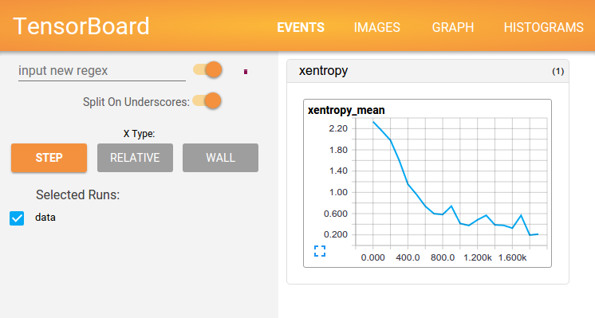

# TensorBoard: Visualizing Learning <a class="md-anchor" id="AUTOGENERATED-tensorboard--visualizing-learning"></a>

The computations you'll use TensorBoard for - like training a massive
deep neural network - can be complex and confusing. To make it easier to
understand, debug, and optimize TensorFlow programs, we've included a suite of
visualization tools called TensorBoard. You can use TensorBoard to visualize
your TensorFlow graph, plot quantitative metrics about the execution of your
graph, and show additional data like images that pass through it. When
TensorBoard is fully configured, it looks like this:




## Serializing the data <a class="md-anchor" id="AUTOGENERATED-serializing-the-data"></a>

TensorBoard operates by reading TensorFlow events files, which contain summary
data that you can generate when running TensorFlow. Here's the general
lifecycle for summary data within TensorBoard.

First, create the TensorFlow graph that you'd like to collect summary
data from, and decide which nodes you would like to annotate with
[summary operations]
(../../api_docs/python/train.md#summary-operations).

For example, suppose you are training a convolutional neural network for
recognizing MNIST digits. You'd like to record how the learning rate
varies over time, and how the objective function is changing. Collect these by
attaching [`scalar_summary`](../../api_docs/python/train.md#scalar_summary) ops
to the nodes that output the learning rate and loss respectively. Then, give
each `scalar_summary` a meaningful `tag`, like `'learning rate'` or `'loss
function'`.

Perhaps you'd also like to visualize the distributions of activations coming
off a particular layer, or the distribution of gradients or weights. Collect
this data by attaching
[`histogram_summary`](../../api_docs/python/train.md#histogram_summary) ops to
the gradient outputs and to the variable that holds your weights, respectively.

For details on all of the summary operations avaiable, check out the docs on
[summary operations]
(../../api_docs/python/train.md#summary-operations).

Operations in TensorFlow don't do anything until you run them, or an op that
depends on their output. And the summary nodes that we've just created are
peripheral to your graph: none of the ops you are currently running depend on
them. So, to generate summaries, we need to run all of these summary nodes.
Managing them by hand would be tedious, so use
[`tf.merge_all_summaries`](../../api_docs/python/train.md#merge_all_summaries)
to combine them into a single op that generates all the summary data.

Then, you can just run the merged summary op, which will generate a serialized
`Summary` protobuf object with all of your summary data at a given step.
Finally, to write this summary data to disk, pass the summary protobuf to a
[`tf.train.SummaryWriter`](../../api_docs/python/train.md#SummaryWriter).

The `SummaryWriter` takes a logdir in its constructor - this logdir is quite
important, it's the directory where all of the events will be written out.
Also, the `SummaryWriter` can optionally take a `GraphDef` in its constructor.
If it receives one, then TensorBoard will visualize your graph as well.

Now that you've modified your graph and have a `SummaryWriter`, you're ready to
start runing your network! If you want, you could run the merged summary op
every single step, and record a ton of training data. That's likely to be more
data than you need, though. Instead, consider running the merged summary op
every hundred steps or so, as in the following code example.

```python
merged_summary_op = tf.merge_all_summaries()
summary_writer = tf.train.SummaryWriter('/tmp/mnist_logs', sess.graph)
total_step = 0
while training:
  total_step += 1
  session.run(training_op)
  if total_step % 100 == 0:
    summary_str = session.run(merged_summary_op)
    summary_writer.add_summary(summary_str, total_step)
```

You're now all set to visualize this data using TensorBoard.


## Launching TensorBoard <a class="md-anchor" id="AUTOGENERATED-launching-tensorboard"></a>

To run TensorBoard, use the command

    python tensorflow/tensorboard/tensorboard.py --logdir=path/to/log-directory

where `logdir` points to the directory where the `SummaryWriter` serialized its
data.  If this `logdir` directory contains subdirectories which contain
serialized data from separate runs, then TensorBoard will visualize the data
from all of those runs. Once TensorBoard is running, navigate your web browser
to `localhost:6006` to view the TensorBoard.

If you have pip installed TensorBoard, you can use the simpler command

    tensorboard --logdir=/path/to/log-directory

When looking at TensorBoard, you will see the navigation tabs in the top right
corner. Each tab represents a set of serialized data that can be visualized.
For any tab you are looking at, if the logs being looked at by TensorBoard do
not contain any data relevant to that tab, a message will be displayed
indicating how to serialize data that is applicable to that tab.

For in depth information on how to use the *graph* tab to visualize your graph,
see [TensorBoard: Visualizing your graph](../../how_tos/graph_viz/index.md).
